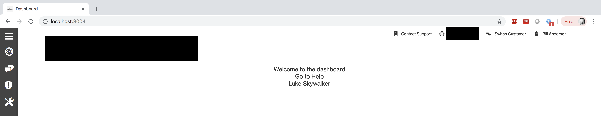
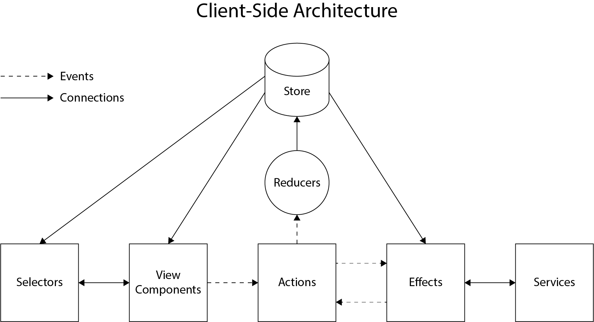
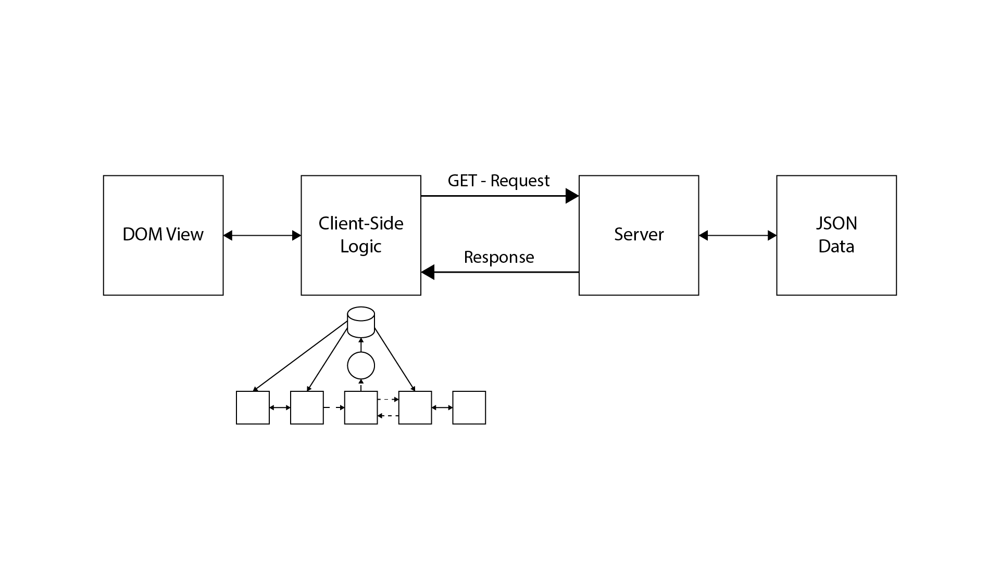

# _REDACTED_ - Starter Project Tutorials

## Creating a Server to Client Data Flow

### Overview

In this series, we are going to cover how to use the _REDACTED_ Starter Project to create a project that gets data from a server and displays it on the client. The end applications is very simple, but to get there, we need to cover a number of steps that will ensure that we are securing and using the data in a effective and resilient way. As applications grow in size, it is easy for the application to become cumbersome and difficult to work with. The _REDACTED_ Start Project has best practices and pattern built into it, to ensure the applications we are building are maintainable, secure, and consistent.

---

### What are we going to build

The application are going to build is a simple one that is going to display data that we tuck into a JSON file on the server.

We are going to start with the _REDACTED_ Starter Project, from there we will:

- Create the JSON data file,
- The server side routes to get to that data,
- The models needed to correctly store the data on the client side,
- The action, effect, reducer, and service associated to accessing that data on the client side,
- The view component to display the data.



The application itself is incredibly simple, as you can see above. However, the "Luke Skywalker" you see above has several steps to get through in order to be displayed on the DOM. The client need to make a request to the server, the server needs to retrieve the data, then the data needs to come back, get stored, and then moved to the right place to be displayed in a Component. We will cover all the steps needed to make a round trip.

Before we get into the specific steps, let's briefly talk about the design of the client side architecture.

---



#### Client Side Architecture

**Store** - Holds current application state,

**Reducers** - Listens for `Actions` that will add/change/remove data in the `Store`,

**Actions** - Provides events/actions that can be called/dispatched from `View Components` or `Effects`,

**Selectors** - Transforms data from the `Store` for a specific `View Component`,

**View Components** - Displays data from the `Store`,

**Effects**

- Listens and dispatches `Actions`,
- Works with `Services` to retrieve data,
- Can retrieve data from the `Store`,

**Services** - Gets data by making HTTP requests

Here is a break down of how they all work together:

1. The `View Component` calls an `Action` that a `Effect` is listening for,
2. The `Effect` works with a `Service` to retrieve data from an api,
3. The `Effect` receives the data from the `Service` and dispatches an `Action` with the data,
4. A `Reducer` listening for that `Action` will take the data and add it to the `Store`,
5. Behind the scenes the `Store` will let the `View Components` or `Selectors` know it has new data,
6. `View Components` will display the new data.

---



#### Overall Architecture

"Zoomed" out, this is how the Client Side Architecture fits into the bigger scheme of things. The client-side architecture represents the client side logic and acts as the interface between the server and the DOM. It manages the flow of data from the server and the data that is on the client-side. Watching all the interactions by the user, making decisions about what can happen locally, and what needs to be sent back to the server to have the data updated.

The scope of this tutorial, is getting you familiar with how the client side can go and retrieve data from the server, to be displayed on the DOM. Actually sending updates of the data, to the server, is outside the scope of this lesson.

---

### Creating our Data

To begin, we are going to create a JSON file that is going to contain an object. The goal of the application will be to move the data from the JSON object we create, to the front end. Along the way, we need to move it through our server and client-side, using the patterns and best practices established by _REDACTED_. This may be a far cry from what you are used to, but along the way, we will do our best to explain why you are setting the project the way that we are. It is important that all follow this convention, as it will make working with other internal applications much easier, more consistent, and resilient. Its a lot to take in, but we are going to start small by creating this little JSON file.

The data we are going to use, is borrowed from the Star Wars API (swapi). It is going to be a 'person' named 'Luke Skywalker', and we are going to send Luke from the back end, to the front end. We did make a few modifications to the data to best match what you would expect to see in ESSA, as well as to best leverage the _REDACTED_ strengths.

Inside the `server/routes/mock-api/` you will create a directory `swapi`. Then inside the new `swapi` directory, create a `person.json` file. Enter the data found below into your new file. Once you are done, there are just a couple things to explain.

File: `server/routes/mock-api/swapi/person.json`

```json
{
  "data": {
    "name": "Luke Skywalker",
    "height": "172",
    "mass": "77",
    "hair_color": "blond",
    "skin_color": "fair",
    "eye_color": "blue",
    "birth_year": "19BBY",
    "gender": "male",
    "homeworld": "https://swapi.co/api/planets/1",
    "films": [
      "https://swapi.co/api/films/2",
      "https://swapi.co/api/films/6",
      "https://swapi.co/api/films/3",
      "https://swapi.co/api/films/1",
      "https://swapi.co/api/films/7"
    ],
    "species": ["https://swapi.co/api/species/1"],
    "vehicles": {
      "make": "Ford",
      "color": "Red"
    },
    "starship": [
      "https://swapi.co/api/starships/12",
      "https://swapi.co/api/starships/22"
    ],
    "created": "2014-12-09T13:50:51.644000Z",
    "edited": "2014-12-20T21:17:56.891000Z",
    "url": "https://swapi.co/api/people/1"
  }
}
```

First, observe the leading `data` key. This was intentionally added to emulate something that you would normally see in an ESSA data return. Next, we changed the `vehicles` key to actually contain an object, rather than another `swapi` link that was originally there. We will use this to talk about nested objects later. Finally, notice how all the values on the keys are `strings`, with the exception of the object just mentioned. This will help us talk about type conversion later.

Now that we got our beginning object, let's move to setting up a way for our server to get that data.

---

### Create the Proxy Route to that data

Next, we need to create a server side route to get at our JSON data that we just created. In the `/server/routes/` directory, create a new file called `person-proxy-route.ts`. Feel free to copy and paste the code from below into your new file. Below we will talk about some important call outs for the file.

File: `/server/routes/person-proxy.route.ts`

```javascript
import * as express from 'express';
import { ProxyBaseRouter } from "./proxy-base.router";
import { VzWebServer } from "@vz/webserver";


export class PersonProxyRoute extends ProxyBaseRouter {
    private _baseUrl: string = VzWebServer.config.get('essa:baseUrl');

    constructor(app: express.Application, routeBase:string) {
        super();

        app.use(`${routeBase}/person`, this._router);

        this._addProxyRoutes();
    }

    private _addProxyRoutes(): void {
        this.get({
            requestFrom: '/get-person',
            requestTo: `${this._baseUrl}/cdm/customers`,
            mockData: '/mock-api/swapi/person.json',
        });
    }
}
```

The class itself is named `PersonProxyRoute` which is our standard format for naming Proxy Routes, which includes the Class you are trying to access, then the words `Proxy` and `Route`. It extends the base class `ProxyBaseRouter` to give it the functionality that all Proxy Routes should have. In the constructor, the class gains access to the Server Application as well as the route base for the application through the constructor arguments. The constructor method basically tells the application to use the new route. Then it calls the `_addProxyRoute` method which assigns a url to point to the data. In this case, we use the `/get-person` post-fixed portion of the url, to get at the `/mock-api/swapi/person.json` file. So the response for accessing that url, will be the JSON data.

---

### Update `src/environments/environment.prod.ts` to include the new route endpoint

Now that we have our new Proxy route, we should add it to our object that keeps track of route constants. This way, if we use the route url in multiple places, we have the constant as the only place we would need to make an update. So we add the `person` key to the `endpointUrl` property, with a value of `person/get-person`. Note the code below only adds a line to the existing file. No need to create a new file or copy and paste the contents of the entore file.

File: `src/environments/environment.prod.ts`

```javascript
export const environment = {
  production: true,
  endpointUrl: {
    appConfigUrl: "publicConfig",
    authLogin: "/identity/logon",
    authLogout: "/identity/logoff",
    userPermissions: "/identity/userPermissions",
    userTermsOfUse: "/customer/usertermsofuse",
    userDetails: "/identity/userDetails",
    customers: "/customer/customers",
    person: "/person/get-person", // Note this is the added line
    customersByFlexId: "/customer/customersbyflexid",
    customerCustomerExampleInfo: "/api/atlasgetcustomervrrinfo",
  },
};
```

---

### Update `server.ts` to include the new route

Now it is time to tell our server about our new route. Head over to the `server/server.ts` file. Here we will add our route to the server by using the `addRoute` method. Let's add it after the other add routes, as to not disturb the other routes currently set in place by _REDACTED_. After the other routes, add `server.addRoute(PersonProxyRoute);`. An example of what the file should look like is below.

File: `server/server.ts`

```javascript
import * as path from "path";
import { VzWebServer } from "@vz/webserver";
import { LogRoute } from "./routes/log.route";
import { CustomerProxyRoute } from "./routes/customer-proxy.route";
import { VzWebServerProxyRoute } from "./routes/vz-web-server-proxy.route";
import { HealthRoute } from "./routes/health.route";
import { PersonProxyRoute } from "./routes/person-proxy.route";

const rootDirectory: string = path.join(__dirname, "../");

const server = new VzWebServer({
  name: "starterproject",
  appDirectory: path.join(rootDirectory, "portal_build"),
  configDirectory: path.join(rootDirectory, "config"),
});

server.addRoute(HealthRoute);
server.addRoute(LogRoute);
server.addRoute(CustomerProxyRoute);
server.addRoute(VzWebServerProxyRoute);
server.addRoute(PersonProxyRoute); // Note that this is the added line

server.startServer();
```

---

### Create a Store for your new Person

To this point, we have done work on the server to house our mock data, and created a way to access that data. Now it's time to start work on our client side to retrieve the data and store it. While we could work directly with the JSON response, as you can imagine, this would create a lot of redundant calls to the server, make for messy intelligence client-side, and all around would make our application difficult to scale. So the next few steps will be all about getting our data from the server in a clean, predictable, and efficient way.

To start, we will create a Model for our Person object response. The set up for this will mirror our JSON data that we created in our first steps. We will create a model that has the same properties as the JSON object. Inside of `src/app/stores/` create a `person` directory, then inside your new person directory, create a `models` directory. Finally, create a `PersonModel.ts` inside of `src/app/stores/person/models`. Copy the contents below into your new `PersonModel.ts` file and we will call out some specifics below.

File: `src/app/stores/person/models/PersonModel.ts`

```javascript
import { BaseModel, IConversionOption, ConversionTypeEnum } from 'sjs-base-model';
import VehicleModel from './VehicleModel';

export default class PersonModel extends BaseModel {

    public readonly name:string = '';
    public readonly height:number = null; // came in as a string
    public readonly mass:string = '';
    public readonly hairColor:string = '';
    public readonly skinColor:string = '';
    public readonly eyeColor:string = '';
    public readonly birthYear:string = '';
    public readonly gender:string = '';
    public readonly homeworld:string = '';
    public readonly films:string[] = [];
    public readonly species:string = '';
    public readonly vehicles: VehicleModel[] = [VehicleModel as any];
    public readonly starships:string = '';
    public readonly created:string = '';
    public readonly edited:string = '';
    public readonly url:string = '';

    public nameAndColor:string = '';

    constructor(data: Partial<PersonModel>) {
        super();

        this.update(data);
    }

    public update(data: Partial<PersonModel>): void {
        const conversionOptions: IConversionOption = {
            height: ConversionTypeEnum.Number
        }

        super.update(data, conversionOptions);

        this.nameAndColor = this.name + this.eyeColor;
    }
}
```

Great, let's take a look at our Model.

#### readonly

With other models you may have created in the past, you may have not included the `readonly` assignment. This ensures that the data can only be read and not written over. In our case, we want the data coming in from the server to remain pristine and untouched (other than some intentional modifications we will make shortly). We will cover changing the data on the server later, but for now, we want this flow of data to be unidirectional. If we want to modify the data for use in our View Components, we will actually modify it at the selector level, rather than the model level.

#### property names

You may have caught already that our casing for the property names differs from the JSON object. The JSON object uses underscores in between the words for each property, where our property names are using `camelCase`. When we extended `BaseModel` part of what we got is a `normalization` of property names. We included this so that we are using a standard convention for the property names, rather than being wildly different depending on which server you are getting data back from, and what the developers decided to do with the data of that server.

Additionally, `BaseModel` does one more key thing for us. If a property does not come back with a value, it will assign the value to a `null` or blank value depending on the type. This ensures that we do not error out on the client side if the data is not exactly like we would expect.

#### height

With height, we opted to change this from a string to a number. This is because we wanted to show how you would go about converting a type here in the model. Currently, the `update` method supports converting to basic types, such as `strings`, `booleans`, and `numbers`. Anything more complex you would want to do in a selector itself. The goal of the model is to keep the data as pristine and as close to the original values as possible. With something like a stringified number coming in, it makes perfect sense to convert it to an actual number before going out ot the rest of the application.

The data for `height` is coming in as a string, but we typed it to a number in the property assignments. This is where the `update` method needs to do some work. Within `update`, notice that we create a constant named `conversionOptions` and type it to a `IConversionOption`. It is then set to an object with keys relative to the keys you want to set. There is an enum set up with the various types you are capable of converting to. In this case, we choose `ConversionTypeEnum.Number`. With that conversionOptions object created, we pass it into super's `update` method as the (optional) second parameter. When this update occurs, it will then convert the property to the new type.

#### vehicles

Remember when we created the JSON object? We set the vehicle to be an object rather than another `swapi` link. Here, we are actually setting it into a whole other type of object, which we have yet to create. Two things to note here. First is that we included a `[]` after the type. This signals to typescript that we want an array of `VehicleModel`s. For the assignment, the syntax may be a little confusing. Any object created with a constructor such as `new VehicleModel()` has the `new` keyword to convert it from a function to an object. Meaning that `VehicleModel()` itself is actually just a function, not an object. With typescript, we can tell the compiler what we actually mean is the `Object` and not the `Function` by using the `as any` syntax. So what we are saying here, is assign the key to an array of `VehicleModels`.

#### nameAndColor

`public nameAndColor:string = '';` = Finally, you will notice that we added an entirely new key value pair outside of the regular JSON data from the server. This is declared with the other properties, however it is separated by a space to signal that this is outside the regular properties. Then, in the update method, we set the value after `super.update()` is called. This is where we can build out those values. A simple example would be something like a `fullname` combining the first name, a space, then the last name. That is, if the first and last name were broken apart from the data on the server.

---

### VehicleModel

Now that we have talked about a `VehicleModel`, let's go ahead and create it. Head over to `src/app/stores/person/models` and create a `VehicleModel.ts` file and paste the below contents.

File: `src/app/stores/person/models/VehicleModel.ts`

```javascript
import { BaseModel } from 'sjs-base-model';

export default class VehicleModel extends BaseModel {

    public readonly make: string = '';
    public readonly color: string = '';

    constructor(data: Partial<VehicleModel>) {
        super();

        this.update(data);
    }

    public update(data: Partial<VehicleModel>): void {

    }
}
```

Nothing really all that special happening in this file. Just two `readonly` strings for `make` and `color`. Standard constructor with a standard call to `super()` and `this.update(data)`. You will need to head back over to your `PersonModel.ts` file and properly import the `VehicleModel` at the top of the file using `import VehicleModel from './VehicleModel';`.

---

### Creating the Person Response Model

To keep things clean, we use a `ResponseModel` pattern to point to the `PersonModel`. This is a much simpler version of a model and acts as a pointer to the core model as a singular key. Inside of `src/app/stores/person/models/` create a `PersonResponseModel.ts` file and past the following code.

File: `src/app/stores/person/models/PersonResponseModel.ts`

```javascript
import { BaseModel } from 'sjs-base-model';
import PersonModel from './PersonModel';

export default class PersonResponseModel extends BaseModel {
    public readonly data: PersonModel = PersonModel as any;

    constructor(data: Partial<PersonResponseModel>) {
        super();

        this.update(data);
    }

    public update(data: Partial<PersonResponseModel>): void {
        super.update(data);
    }
}
```

Note that the `data` key in the constructor is typed as `Partial<PersonReponseModel>`. This allows an incomplete set of data to be used to create a `PersonModel`. Remember that `BaseModel` allows this to happen and will backfill any missing assignments to `null` or empty values on keys that were not given value.

---

### Creating the Person Action

Now we are going to create our action to work with our data loading events. We need to know when the data is being loaded, and when it has successfully loaded.

Create a `person.action.ts` inside your new `src/app/stores/person/` directory. Then copy the code below into your new file.

File: `src/app/stores/person/person.action.ts`

```javascript
import {IAction} from '../i-action';
import PersonModel from './models/PersonModel';

export class PersonAction {
    public static readonly LOAD_PERSON: string = 'PersonAction.LOAD_PERSON';
    public static readonly LOAD_PERSON_SUCCESS: string = 'PersonAction.LOAD_PERSON_SUCCESS';

    public static loadPerson(): IAction<void> {
        return {
            type: PersonAction.LOAD_PERSON,
        };
    }

    public static loadPersonSuccess(model: PersonModel): IAction<PersonModel> {
        return {
            type: PersonAction.LOAD_PERSON_SUCCESS,
            payload: model,
        };
    }
}
```

Note that this follows the standard pattern for actions. Additionally, each action is set to a type of `IAction` which follows the Flux pattern for actions.

Note: This is the `src/app/stores/i-action.ts` file, however no changes are needed. Here for reference.

```javascript
import { Action } from "@ngrx/store";

/**
 * https://github.com/acdlite/flux-standard-action
 */
export interface IAction<T> extends Action {
  type: string;
  payload?: T;
  error?: boolean;
  meta?: any;
}
```

A couple notes on `IAction` and its keys that it accepts:

- Type, standard Type key for Flux patterns,
- Payload, the model in which you are accepting,
- Error, false is standard. While this is named `error`, note that it is just used as a catch. For example, if you are waiting for data to come back, you may want to set this to true so that you can remove a loading spinner. This is placed here so that you have the option to catch and respond.
- Meta, this can be anything else that you want to include. This provides a way to include additional information. A good example here, would be some sort of `id` that may not be included on the model itself.

---

### Create a Person Reducer in `/src/app/stores/person/`

Now we are going to create our Person Reducer. This will tie together the Person Model, The Person Reducer State, and the Person Action. Inside of `/src/app/stores/person/` create a `person.reducer.ts` file. Copy the contents below into the new file.

File: `/src/app/stores/person/person.reducer.ts`

```javascript
import { IPersonReducerState } from "./models/IPersonReducerState";
import { IAction } from "../i-action";
import { PersonAction } from "./person.action";
import PersonModel from "./models/PersonModel";

export class PersonReducer {
    private static readonly _initialState: IPersonReducerState = {
        person: null,
        isLoadingPerson: false,
    }

    public static reducer(
        state: IPersonReducerState = PersonReducer._initialState,
        action: IAction<any>
    ): IPersonReducerState {
        switch(action.type){
            case PersonAction.LOAD_PERSON:
                return PersonReducer._loadPerson(state, action);
            case PersonAction.LOAD_PERSON_SUCCESS:
                return PersonReducer._loadPersonSuccess(state, action);
            default:
                return state;
        }
    }

    private static _loadPerson(state: IPersonReducerState, action: IAction<void>):
        IPersonReducerState {
            return {
                ...state,
                isLoadingPerson: true,
            }
    }

    private static _loadPersonSuccess(state: IPersonReducerState, action: IAction<PersonModel>):
        IPersonReducerState {
            return {
                ...state,
                isLoadingPerson: false,
                person: action.payload,
            }
        }
}
```

There is a lot of standard reducer code here, so if any of this is unfamiliar, make sure to circle back on your reducer learnings! There are a couple patterns of note here however:

#### `loadPerson` and `loadPersonSuccess`

Here we have the two major events that we are going to work from. These will become standard events of note when working with data from the server. One is when we actually call to load in a `person` and the other is when the `person` comes back from the server. `loadPersonSuccess` of course being when the data comes back from the server.

#### `isLoading` property

Note that we added another property onto the Reducer. That is the `isLoadingPerson` key. Naming convention will have you prefix `isLoading` and then include the name of the model you are loading. Also note what the methods return. They return `IPersonReducerState`s, which we have yet to create. But the return here includes the `ES6` spread operator, ensuring that the key values are assigned from the state argument that comes in, but then we override any additional values after the initial state spread operator. So in the case of the `isLoading` flag, we set it to true on initial call, then false when success comes back.

---

### Create a Person Reducer State

Now let's actually create that `IPersonReducerState` we mentioned above. Inside of `/src/app/stores/person/models`, create a `IPersonReducerState.ts` file and copy the contents below into it.

File: `/src/app/stores/person/models/IPersonReducerState.ts`

```javascript
import PersonModel from "./PersonModel";

export interface IPersonReducerState {
    readonly person: PersonModel;
    readonly isLoadingPerson: boolean;
}
```

Nothing crazy happening here. We are just creating an interface for the `PersonReducerState` to ensure that we are pointing to a `PersonModel` and that any use of the interface includes an `isLoading` property as well. That way we know that the call has made a complete round trip from client, to server, back to client.

---

### Register our Reducer with the Root Reducer

Over in our `../src/app/stores/root-reducer.ts`, we need to make an update. Specifically, we need to add a key of `personReducer` with a value of `PersonReducer.reducer`. Note the the `.reducer` is a method we included when we created our reducer. So we are setting our key to the return value of that.

File: `../src/app/stores/root-reducer.ts`

```javascript
import * as fromRouter from "@ngrx/router-store";
import { ActionReducerMap } from "@ngrx/store";
import { AppConfigReducer } from "./app-config/app-config.reducer";
import { IStore } from "./i-store";
import { ErrorsReducer } from "./errors/errors.reducers";
import { PersonReducer } from "./person/person.reducer";

export const rootReducer: ActionReducerMap<Partial<IStore>> = {
  appConfigReducer: AppConfigReducer.reducer,
  errorsReducer: ErrorsReducer.reducer,
  routerReducer: fromRouter.routerReducer,
  personReducer: PersonReducer.reducer, // Note that this is the line we added
};
```

---

### Creating our Person Effect

Now we need to make the hook used between our View component and our action. So over in the `/src/app/stores/person/`, create a `person.effect.ts` file. Copy the contents from below into the file.

File: `/src/app/stores/person/person.effect.ts`

```javascript
import { Injectable } from "@angular/core";
import { PersonService } from "./person.service";
import { Effect, Actions, ofType } from "@ngrx/effects";
import { Observable } from "rxjs";
import { IAction } from "../i-action";
import PersonModel from "./models/PersonModel";
import { HttpErrorResponse } from "@angular/common/http";
import { PersonAction } from "./person.action";
import { switchMap, map } from "rxjs/operators";
import PersonResponseModel from "./models/PersonResponseModel";
import { ErrorsAction } from "../errors/errors.action";

@Injectable()
export class PersonEffect {
    constructor(
        private _personService: PersonService,
        private _actions$: Actions

    ){ }

    @Effect()
    public fetchPerson(): Observable<IAction<PersonModel | HttpErrorResponse>> {
        return this._actions$.pipe(
            ofType(PersonAction.LOAD_PERSON),
            switchMap((action: IAction<void>) => {
                return this._personService.getPerson().pipe(
                    map((responseModel: PersonResponseModel | HttpErrorResponse) => {
                        if(responseModel instanceof HttpErrorResponse) {
                            return ErrorsAction.requestFailure(responseModel);
                        }

                        return PersonAction.loadPersonSuccess(responseModel.data);
                    })
                );
            })
        );
    }
}
```

This creates an effect called `fetchPerson` which sets up an `Observable` to go and actually retrieve the person from the server. Notice how we call the `.getPerson` method using the `_personService`. That will go make the call to the server, expecting back either a `PersonResponseModel` or some sort of `HttpErrorResponse`. If the person comes back, we call the `loadPersonSuccess` method, passing along the data from the server. Remember that this gets passed to that spread operator, that will map all the data to a Person Object.

---

### Creating the Person Service

Now we actually need to create that person service! Create a Person Service in `/src/app/stores/person/`, make sure to name it `person.service.ts`.

File: `/src/app/stores/person/person.service.ts`

```javascript
import {Injectable} from '@angular/core';
import {Observable, of} from 'rxjs';
import {HttpClient, HttpErrorResponse} from '@angular/common/http';
import {environment} from '../../../environments/environment';
import {catchError, map} from 'rxjs/operators';
import PersonResponseModel from './models/PersonResponseModel';
import { PropertyNormalizerUtility } from '../../utilities/property-normalizer.utility';

@Injectable()
export class PersonService {
    constructor(private _http: HttpClient) {}

    public getPerson(): Observable<PersonResponseModel | HttpErrorResponse> {
        const endpointUrl: string = environment.endpointUrl.person;

        return this._http.get(endpointUrl).pipe(
            map((response: object) => PropertyNormalizerUtility.normalize(response)),
            map((response: object) => new PersonResponseModel(response)),
            catchError((errorResponse: HttpErrorResponse): Observable<HttpErrorResponse> => of(errorResponse))
        );
    }
}
```

Here you can see that we are using the endpoint we created in the very beginning and using an `http` service to make a GET call to that url. When the data comes back, it is `normalized` using the `PropertyNormalizerUtility` that we provided. Then, it's mapped to a `PersonReponseModel`. Error checking is included as well of course!

---

### Registering your effect in the root effect

Now it's time to register your effect in the `root-effect.ts`, head over to the file and make the updates shown below.

File: `/src/app/stores/root-reducer.ts`

```javascript
import { AppConfigEffect } from "./app-config/app-config.effect";
import { Type } from "@angular/core";
import { PersonEffect } from "./person/person.effect";

export const rootEffect: Type<any>[] = [
  AppConfigEffect,
  PersonEffect, // Note that this is the line that we added
];
```

This allows our effect to be used by the application. It makes it aware that it exists!

---

### Register your service in the app module

Register your service in the `app.module.ts` by heading over to the file and adding the line included below.

File: `/src/app/app..module.ts`

```javascript
// ...
@NgModule({
    // ...
    providers: [
        {
            provide: RouterStateSerializer,
            useClass: CustomRouterStateSerializer,
        },
        {
            provide: OWL_DATE_TIME_FORMATS,
            useValue: datePickerMomentFormats,
        },
        AppConfigService,
        PersonService // Note that this is the line that we added
    ],
    // ...
// ...
```

Now our Service is available to the rest of the application! Which means that we can now access our data by using the service.

---

### Creating the View Component

Create a `person` folder in the `src/app/views/` directory. Inside of that, create a `person.component.html`, `person.component.scss`, and `person.component.ts`,

NOTE: THAT YOU CAN USE [ANGULAR CLI](https://cli.angular.io/) TO THIS QUICKLY!
If you have Angular CLI installed, nav to folder, then use the `ng generate component person` command. Delete the `spec.ts` folder if you are not creating tests. (If you created using the Angular CLI command)

Now open up the `person.component.html` file and enter the following code.

File: `/src/app/views/‘src/app/views/person/person.component.html`

```html
<div class="container">
  {{(person$ | async).name}}
</div>
```

Here we access the `person$` property which will create in the next step. This will how we access our data on the `PersonModel` that has stored the JSON data from the server. Also notice the pipe (`|`) followed by `async`. If this is unfamiliar to you, make sure to go back and checkout the Angular learning for details.

Update the `person.component.ts` to the new changes. Note that generating the code with angular cli will leave out some key pieces of information that you will need to add. So be sure to compare the code correctly. It would be easy to miss something!

File: `/src/app/views/person/person.component.ts`

```javascript
import { Component, OnInit, ViewEncapsulation } from '@angular/core';
import { Observable } from 'rxjs';
import { IStore } from '../../stores/i-store';
import { select, Store } from '@ngrx/store';
import PersonModel from '../../stores/person/models/PersonModel';

@Component({
  selector: 'starterproject-person',
  templateUrl: './person.component.html',
  styleUrls: ['./person.component.scss'],
  encapsulation: ViewEncapsulation.Emulated
})
export class PersonComponent implements OnInit {
    public person$: Observable<PersonModel> = null;

    constructor(private _store$: Store<IStore>) { }

    public ngOnInit(): void {
        this.person$ = this._store$.pipe(
            select((store: IStore) => store.personReducer.person)
        );
    }

}
```

Here we are adding a little information to our component. We created a `person$` property, which is an `Observable`. Then on init, we set that equal to the result of the select method, which reaches across our files, into the server, and grabs the JSON data. All of that data is now stored on the `person$` property! Which means that we can access the various pieces of information stored on in (such as .name in our example above).

Finally, lets add our component into our current project. Add in your new component to the `dashboard-component.html`,

File: `/src/app/views/dashboard/dashboard.component.ts`

```html
<div style="text-align:center;">
  <h1>
    {{title}}
  </h1>

  <a routerLink="/help">Go to Help</a>

  <starterproject-person></starterproject-person>
</div>
```

We have registered our `service` to the `app.module.ts` file, but we also need to register our new view component. Head back over to `app.module.ts` and lets add our component (Note that if you did this with the Angular CLI, this step may already be done).

File: `/src/app/app.module.ts`

```javascript
// ...
@NgModule({
    declarations: [AppComponent, DashboardComponent, HelpComponent, PersonComponent], // Note this is the line we adjusted
    imports: [
    // ...
// ...
```

Run the project and observe that you got your data!

---

That covers the regular flow of data from the server to the client. It starts with a component calling its `onInit()` method, reaches through the services back to the server, grabs the JSON, then sends it back to the client to be stored on a property within the component (stored in a store for other components!). In the next series, we will take a closer look at Selectors and how to correctly augment data for business logic purposes.

Thank you so much for taking this tutorial!
